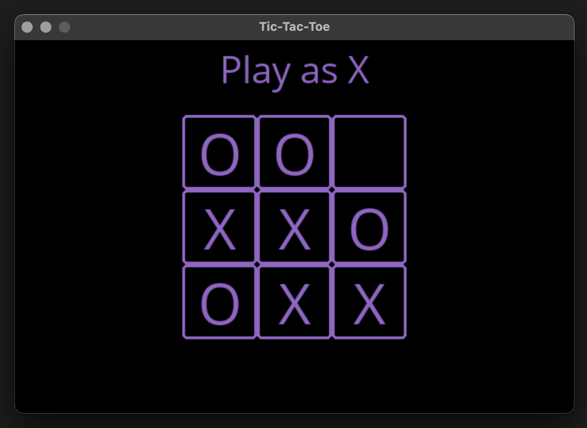

# Minimax Algorithm - Tic Tac Toe

This project implements the Minimax algorithm to create an AI for a turn-based game. The Minimax algorithm simulates all possible moves and evaluates the best move for the AI, considering the game state and the opponent's moves.

## Execution

   ```bash
   python runner.py
   ```


